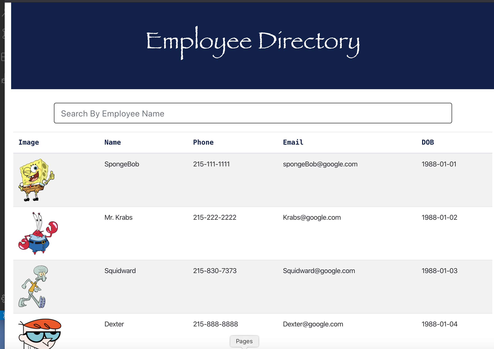

# Employee Directory App

## Overview

This project is an employee directory created with React.  It allows people to instantly search for information about Employees just by typing a name in the search bar.  In addition to searching for employees, the user can also sort employees by image, name, phone, email, and date-of-birth.  

## User Story

* As a user, I want to be able to view my entire employee directory at once so that I have quick access to employee information.

## Business Context

An employee or manager would benefit greatly from being able to view non-sensitive data about other employees. It would be particularly helpful to be able to filter employees by name.

Given a table of random users, when the user loads the page, a table of employees should render.  The user is able to:

  * Sort the table by image, name, phone, email, and date-of-birth.

  * Filter the users by name.

